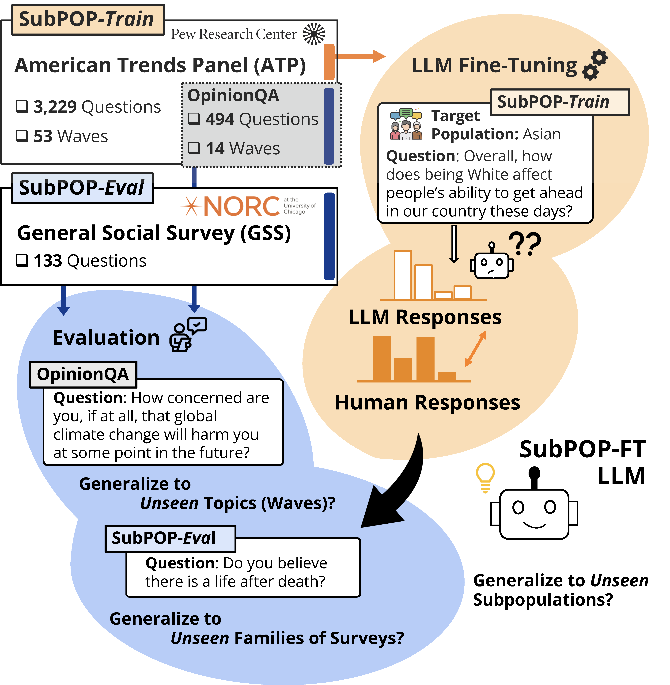

# Language Model Fine-Tuning on Scaled Survey Data for Predicting Distributions of Public Opinions

<!--- BADGES: START --->
[][#arxiv-paper-package]
[](https://opensource.org/licenses/BSD-3-Clause)


[#license-gh-package]: https://lbesson.mit-license.org/
[#arxiv-paper-package]: https://arxiv.org/abs/2502.16761
<!--- BADGES: END --->

<p align="center">
<a href="https://arxiv.org/abs/2502.16761">Read the paper</a>
</p>
<p align="center">
  
</p>

**Can LLMs assist public opinion survey designs by predicting responses?**

We fine-tune LLMs on our new large-scale survey response dataset, **SubPOP**, which reduces the distributional gap between human-LLM predictions by up to 46% 📊
For more details, please check out our [paper](https://arxiv.org/abs/2502.16761).

---

## Installation

To install the required packages, you can create a conda environment, clone, and install the dependencies as:
```bash
conda create -n subpop python=3.10 -y
conda activate subpop

git clone git@github.com:JosephJeesungSuh/subpop.git
cd subpop
pip install -r requirements.txt
pip install -e .
```

---

## Basic Run
To reproduce the fine-tuning and evaluations in the paper, run the following three sections in sequence:

(1) Prepare dataset

(2) Fine-tune the base model (you can skip this step with the provided model weights)

(3) Run inference and measure the response probability distribution

## Prepare Dataset

### Step 0. Download Dataset

We offer two options for obtaining the dataset:

**Option 1**. Download Preprocessed Subpopulation-Level Response Distribution Data

You can directly download the preprocessed SubPOP dataset from the [HuggingFace dataset repository](https://huggingface.co/datasets/jjssuh/subpop).
This dataset includes two files: SubPOP-*Train* and SubPOP-*Eval* in a `.jsonl` format.
Before downloading, you have to agree to the dataset's terms of use.
After downloading these files, place them under `data/subpop-train/processed/` and `data/subpop-eval/processed/`, respectively.
Then proceed directly to [Step 3: Generate Fine-Tuning Dataset](#step-3-generate-fine-tuning-dataset).

**Option 2**. Curate Dataset from Raw Survey Responses

For greater transparency and to facilitate further research involving raw survey data preprocessing, we provide a data curation pipeline.
If you prefer to curate the dataset yourself, you'll first need to obtain the original survey response data:

For SubPOP-*Train*, please visit American Trends Panel wave 61-132 
from [Pew Research](https://www.pewresearch.org/american-trends-panel-datasets/)
and place all .sav files (ex. `ATP W132.sav`) under the `data/subpop-train/` directory.

For SubPOP-*Eval*, please visit 2022 General Social Survey
from [NORC](https://gss.norc.org/us/en/gss/get-the-data/stata.html)
and place the .dta file (`GSS2022.dta`) under `data/subpop-eval`.

For OpinionQA, the group-level survey response result is provided by
[OpinionQA official repository](https://github.com/tatsu-lab/opinions_qa),
and we adopt this survey dataset by locating it at `data/opinionqa/processed/opinionqa.csv`.

### Step 1. Refine Question Text

As a first step, you can refine the question text with the following command.
Processed question text will be placed at `data/subpop-train/processed/refined_qkey_dict.json`.
You need to first register your OpenAI API key to the environment: `export OPENAI_API_KEY="sk-XXX"`

```bash
python scripts/data_generation/refine_question.py
```

For SubPOP-*Eval* we provide a refined version at `data/subpop-eval/processed/refined_qkey_dict.json`.
For OpinionQA, we provide a refined version at `data/opinionqa/processed/refined_qkey_dict.json`
which was developed by [OpinionQA](https://github.com/tatsu-lab/opinions_qa).

### Step 2. Obtain Response Distribution

American Trends Panel and General Social Survey provide responses of anonymized individuals.
You can obtain the response distribution per each subpopulation by aggregating individual responses
with the command:

```bash
python scripts/data_generation/generate_distribution.py
    --dataset {DATASET_NAME}
    --n_workers {NUM_WORKERS}
    --demographics_data_path {PATH_TO_SUBPOPULATION_METADATA}
```

- `dataset`: Dataset name. Use `subpop-train` or `subpop-eval`.
- `n_workers`: (Optional) Number of spawned processors. Default to 1.
- `demographics_data_path`: (Optional) Path to the metadata of subpopulations. Default to `data/subpopulation_metadata/demographics_22.csv`.

Running the script with a specified dataset name will result in 22 subpopulations response distribution
located at `data/{DATASET_NAME}/processed/{DATASET_NAME}.csv`.

### Step 3. Generate Fine-Tuning Dataset

This step converts the response distribution data from the previous step into a ready-to-go fine-tuning dataset.
You can run the following command:

```bash
python scripts/data_generation/prepare_finetuning_data.py
    --dataset {DATASET_NAME}
    --steer_prompts_file_path {PATH_TO_STEERING_PROMPT}
    --steer_demographics_file_path {PATH_TO_SUBPOPULATION_METADATA}
    --train_ratio {TRAIN_RATIO}
    --val_ratio {VALIDATION_RATIO}
    --test_ratio {TEST_RATIO}
```

- `dataset` : Dataset name. Use `subpop-train`, `subpop-eval`, or `opinionqa`.
- `steer_prompts_file_path` : (Optional) Path to the metadata of steering prompts. Default to `data/subpopulation_metadata/steering_prompts.json`.
- `steer_demographics_file_path` : (Optional) Path to the metadata of subpopulations. Default to `data/subpopulation_metadata/demographics_22.csv`.
- `train_ratio` : Portion for train. Used value is 0.9 for SubPOP-*Train*, 0.0 for SubPOP-*Eval* and OpinionQA.
- `val_ratio` : Portion for validation. Used value is 0.1 for SubPOP-*Train*, 0.0 for SubPOP-*Eval* and OpinionQA.
- `test_ratio` : Portion for test. Used value is 0.0 for SubPOP-*Train*, 1.0 for SubPOP-*Eval* and OpinionQA.

Running the script with a specified dataset name will result in fine-tuning data
located at `data/{DATASET_NAME}/processed/opnqa_{QA,BIO,PORTRAY,ALL}_{train,val,test}.csv`.
You can transfer the generated files `data/subpop-train/processed/opnqa_QA_{train,val,test}.csv` to `train/datasets/subpop-train` directory and move on to the next step.

---

## Fine-tune the Base Model

For fine-tuning the base model to predict opinion response distribution,
we build on [llama-cookbook (formerly llama-recipes)](https://github.com/meta-llama/llama-cookbook).
The following command takes a train file (generated in the 'Prepare Dataset' section) and a base language model as an input,
and trains a LoRA module.

To use trained LoRA modules, check [checkpoints](#model-checkpoints).

```bash
export HF_TOKEN=${HF_TOKEN}
export WANDB_API_KEY=${WANDB_API_KEY} # optional
export TOKENIZERS_PARALLELISM=true # optional

torchrun --nnodes=1
    --nproc-per-node=${NPROC_PER_NODE}
    --master_port=${MASTER_PORT}
    scripts/experiment/run_finetune.py
    --enable_fsdp
    --low_cpu_fsdp
    --fsdp_config.pure_bf16
    --use_peft=${USE_PEFT}
    --use_fast_kernels
    --checkpoint_type StateDictType.FULL_STATE_DICT
    --peft_method='lora'
    --use_fp16
    --mixed_precision
    --batch_size_training ${BATCH_SIZE_TRAINING}
    --val_batch_size ${BATCH_SIZE_VALIDATION}
    --gradient_accumulation_steps ${GRADIENT_ACCUMULATION_STEPS}
    --dist_checkpoint_root_folder ${DIST_CHECKPOINT_ROOT_FOLDER}
    --dist_checkpoint_folder ${DIST_CHECKPOINT_FOLDER}
    --batching_strategy='padding'
    --dataset ${DATASET}
    --output_dir DIR_TO_OUTPUT_MODEL
    --dataset_path ${DATASET_PATH}
    --steering_type ${STEERING_TYPE}
    --model_name ${MODEL_NAME_OR_PATH}
    --model_nickname ${MODEL_NICKNAME}
    --lr ${LR}
    --num_epochs ${NUM_EPOCHS}
    --weight_decay ${WEIGHT_DECAY}
    --loss_function_type ${LOSS_FUNCTION_TYPE}
    --which_scheduler ${WHICH_SCHEDULER}
    --warmup_ratio ${WARMUP_RATIO}
    --gamma ${GAMMA}
    --attribute ${ATTRIBUTE}
    --group ${GROUP}
    --lora_config.r ${LORA_RANK}
    --lora_config.lora_alpha ${LORA_ALPHA}
    --is_chat ${IS_CHAT}
    --name NAME_OF_WANDB_RUN
    --wandb_config.project NAME_OF_WANDB_PROJECT
    --wandb_config.entity NAME_OF_WANDB_ENTITY
```

where we provide an example of environment variables as follows:

```bash
envs:
  MASTER_PORT: 29501
  NPROC_PER_NODE: 2
  USE_PEFT: True
  LR: 2e-4
  NUM_EPOCHS: 50
  WEIGHT_DECAY: 0
  LOSS_FUNCTION_TYPE: ce # ce or wd, depending on the training objective to use.
  WHICH_SCHEDULER: cosine # cosine or step, for linear warmup with cosine decay or StepLR
  WARMUP_RATIO: WARMUP_RATIO # used for cosine
  GAMMA: GAMMA # used for StepLR
  BATCH_SIZE_TRAINING: 128
  BATCH_SIZE_VALIDATION: 128
  GRADIENT_ACCUMULATION_STEPS: 1
  DATASET: opnqa_steering_dataset
  STEERING_TYPE: QA
  DATASET_PATH: subpop-train
  MODEL_NICKNAME: llama-2-7b-base
  MODEL_NAME_OR_PATH: meta-llama/Llama-2-7b-hf
  IS_CHAT: False # True if using chat model (ex. llama-2-7b-chat)
  ATTRIBUTE: None
  GROUP: None
  DIST_CHECKPOINT_ROOT_FOLDER: None # only used for full fine-tuning
  DIST_CHECKPOINT_FOLDER: None # only used for full fine-tuning
  LORA_RANK: 8 # used for PEFT
  LORA_ALPHA: 32 # used for PEFT
  HF_TOKEN: YOUR_HF_TOKEN
  WANDB_API_KEY: YOUR_WANDB_KEY
```

To launch a training job on the [Strong Compute](https://strongcompute.com/) instance, you can run the following code:
```bash
isc_project_id = STRONG_COMPUTE_PROJECT_ID
experiment_name = YOUR_EXPERIMENT_NAME
gpus = 6
compute_mode = "interruptible"
output_path = "~/outputs/subpop-train"
command = '''
export HF_TOKEN=$HF_TOKEN
source ~/.subpop/bin/activate && cd ~/isc/llama-recipes/ &&
torchrun --nnodes=$NNODES --nproc-per-node=$N_PROC
--master_addr=$MASTER_ADDR --master_port=$MASTER_PORT --node_rank=$RANK
finetuning.py ...''' # additional arguments
```
for more information, please refer to the Strong Compute's [ISC documentation](https://strong-compute.gitbook.io/developer-docs).

### Model Checkpoints

We release LoRA checkpoints for four base models:
[Llama-2-7B base](https://huggingface.co/jjssuh/llama-2-7b-subpop),
[Llama-2-13B base](https://huggingface.co/jjssuh/llama-2-13b-subpop),
[Mistral-7B-v0.1 base](https://huggingface.co/jjssuh/mistral-7b-v0.1-subpop),
and [Llama-3-70B base](https://huggingface.co/jjssuh/llama-3-70b-subpop).
Please note that the base models are pretrained base models not instruction fine-tuned.

---

## Run Inference and Measure Response Distribution

For running inference and measuring log-probability, we support vLLM offline batched inference.
For more information, refer to vLLM documentation (https://docs.vllm.ai/en/latest/getting_started/quickstart.html).
The following command takes a test file (generated in the 'Prepare Dataset' section)
and a (fine-tuned) LLM as an input, and generates response distribution along with the Wasserstein distance.

```bash
python scripts/experiment/run_inference.py
    --input_paths {PATH_TO_TEST_FILE}
    --output_dir {DIR_TO_SAVE_OUTPUT}
    --base_model_name_or_path {MODEL_NAME_OR_LOCAL_PATH_TO_MODEL}
    --tp_size {TENSOR_PARALLEL_REPLICAS}
    --lora_path {LORA_NAME_OR_LOCAL_PATH_TO_LORA_MODULES}
    --lora_name {CUSTOM_NAME_FOR_OUTPUT_NAMING}
```

- input_paths: Path or a list of paths to the input file(s). For example, `data/subpop-eval/processed/opnqa_QA_test.csv`.
- output_dir: Output file's directory.
- base_model_name_or_path: Base model name. For example, `meta-llama/Llama-2-7b-hf`.
- tp_size: (Optional) The number of GPUs to use for tensor parallelism.
- lora_path: (Optional) Path or a list of paths to the LoRA module(s). For example, `jjssuh/llama-2-7b-subpop`. To run inference with a base model, don't use this argument.
- lora_name: (Optional) A name that a user chooses to call each LoRA module. For example, `llama-2-7b-subpop-FT`.

After inference, you can refer to `scripts/experiment/analyze_inference_result.ipynb`
for calculation of the Wasserstein distance and reproduce the final result.

---

## Contact

For any questions or issues about the paper and implementation, please open an issue or contact josephsuh@berkeley.edu.

## Citation

```
@article{suh2025language,
  title={Language Model Fine-Tuning on Scaled Survey Data for Predicting Distributions of Public Opinions},
  author={Suh, Joseph and Jahanparast, Erfan and Moon, Suhong and Kang, Minwoo and Chang, Serina},
  journal={arXiv preprint arXiv:2502.16761},
  year={2025}
}
```
